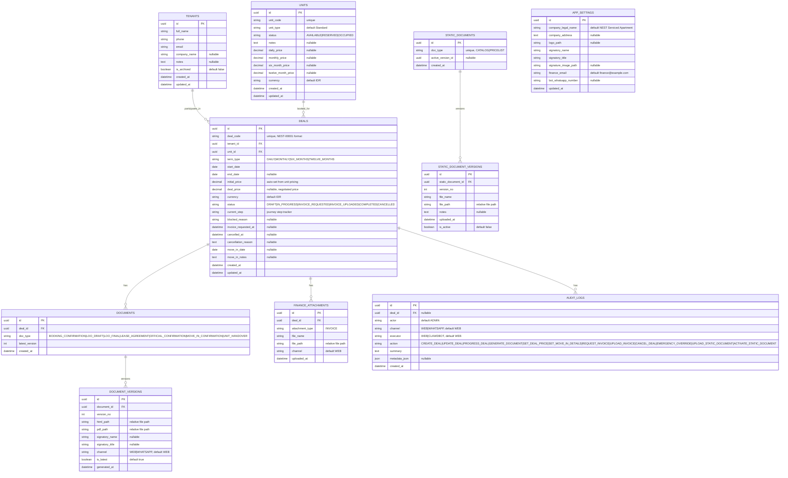

# Entity Relationship Diagram — NestApp (As Implemented)

> This ERD reflects the **actual database schema** as implemented. The original PRD proposed
> separate tables (ADMINS, UNIT_PRICING, COMPANY_SETTINGS, FINANCE_SETTINGS, BOT_SETTINGS,
> SIGNATURE_ASSETS); the implementation uses a simplified schema noted below.

## Simplifications from Original ERD

| Original PRD Design | Actual Implementation | Rationale |
|---|---|---|
| `ADMINS` table | No table — env vars (`ADMIN_USER`, `ADMIN_PASSWORD`) with JWT auth | Single admin user, no need for DB-managed users |
| `UNIT_PRICING` table | Pricing columns inline on `UNITS` (`daily_price`, `monthly_price`, etc.) | One price per term per unit is sufficient |
| `COMPANY_SETTINGS` + `FINANCE_SETTINGS` + `BOT_SETTINGS` | Single `APP_SETTINGS` table | All settings managed by same admin, single row |
| `SIGNATURE_ASSETS` table | `signature_image_path` on `APP_SETTINGS` | One active signature is enough for Phase 1 |
| `DEAL_DOCUMENTS` + `DEAL_DOCUMENT_VERSIONS` | `DOCUMENTS` + `DOCUMENT_VERSIONS` | Simplified naming, same behavior |
| `LIBRARY_DOCUMENTS` + `LIBRARY_DOCUMENT_VERSIONS` | `STATIC_DOCUMENTS` + `STATIC_DOCUMENT_VERSIONS` | Simplified naming, same behavior |
| Deal `list_price` | Deal `initial_price` | Renamed for clarity (auto-set from unit price at deal creation) |
| Deal `status` values BLOCKED/CLOSED | DRAFT/IN_PROGRESS/INVOICE_REQUESTED/INVOICE_UPLOADED/COMPLETED/CANCELLED | More granular statuses reflecting actual workflow |
| Unit status MAINTENANCE | Removed | Not needed in Phase 1 |

## Authentication Model

- No `ADMINS` table in database
- Admin credentials stored as environment variables
- JWT tokens (HS256) with 24-hour expiry, signed with `API_SECRET_KEY`
- Login via `POST /auth/login` returns Bearer token
- All protected endpoints validate token via `Authorization: Bearer <token>` header
- Document preview/download endpoints also accept `?token=<jwt>` query parameter
