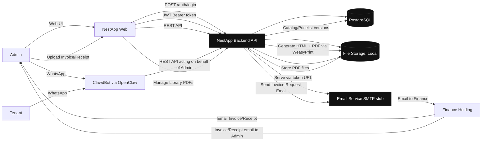
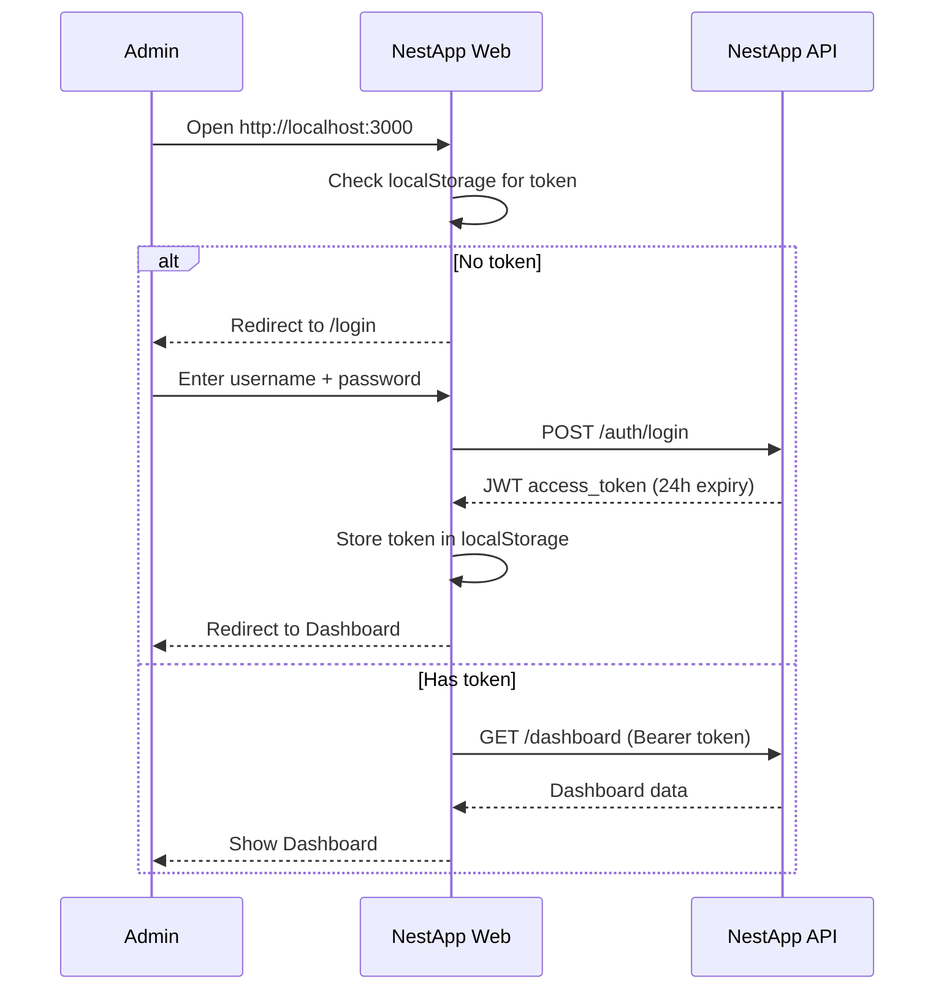
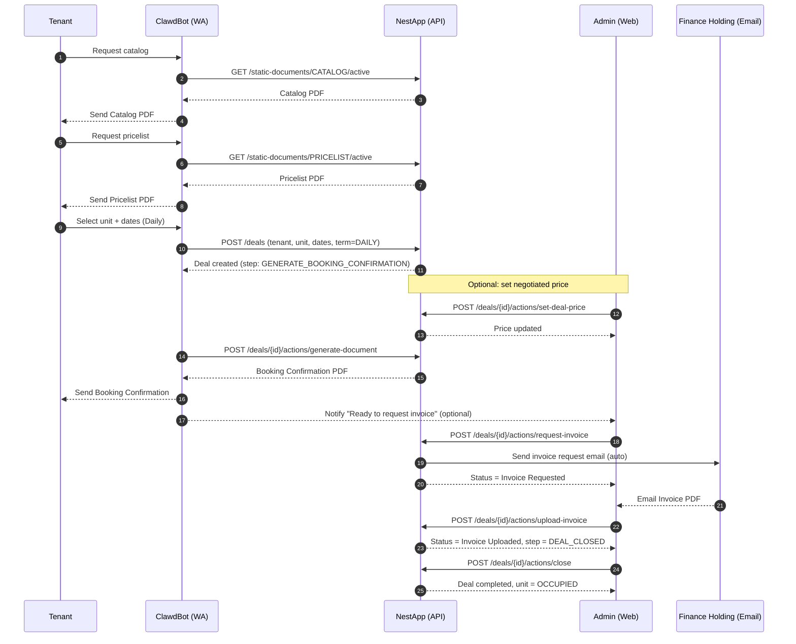
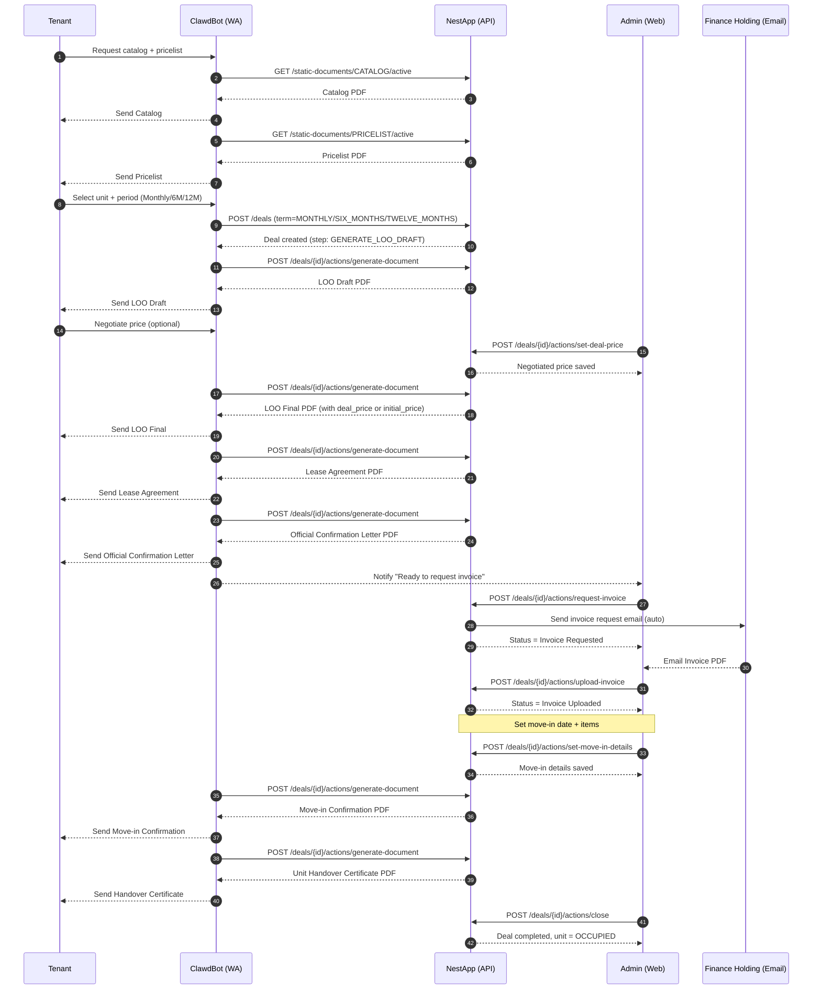
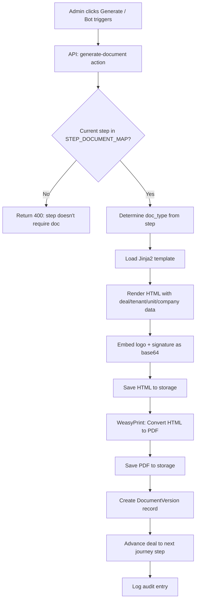

# System Context & Data Flow — NestApp

## A. System Context Diagram

---

## B. Authentication Flow

---

## C. Daily Stay Flow (5 Steps)

---

## D. Monthly / 6M / 12M Flow (10 Steps)

---

## E. Document Generation Flow

**File naming format:** `{DocName}_{TenantName}_{UnitCode}_{Date}_v{Version}.pdf`
Example: `Booking-Confirmation_John-Doe_101_2026-02-07_v1.pdf`
